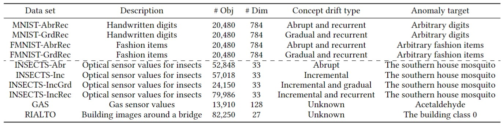
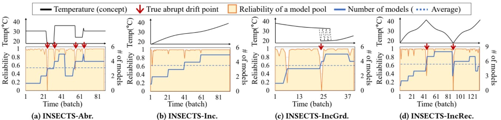
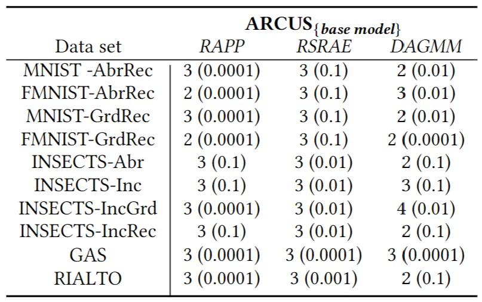

# Adaptive Model Pooling for Online Deep Anomaly Detection from a Complex Evolving Data Stream
This is the implementation of ARCUS published in KDD 2022 [[paper](https://arxiv.org/abs/2206.04792)]


## Required packages
- Tensorflow 2.2.0
- Python 3.8.3
- Scikit-learn 0.23.1
- Numpy 1.18.5
- Pandas 1.0.5

## Data sets description and link
- The last column in each data set file refers to the anomaly label (1: anomaly, 0:normal)   </br>
- [Data sets link](https://www.dropbox.com/sh/a3fhtp9zjjujrwa/AAD_4wkFaULuK-uJinbtw81Oa?dl=0) </br>
- The link includes the small data sets (also included in the repository) and large data sets exceeding 100MB </br>
 


## How to run ARCUS
### Parameters
- batch: batch size (default: 512)
- min_batch: min batch size (default: 32)
- init_epoch: initial number of epochs for creating models (default: 5)
- intm_epoch: interim number of epochs for training models after initialization  (default: 1)
- hidden_dims: latent dimensionality of AE (default: the number of pricipal component explaining at least 70% of variance)
- layer_num: number of layers in AE
- model_type: type of model, one of ["RAPP", "RSRAE", "DAGMM"]
- inf_type: type of inference, one of ["INC", "ADP"] where "INC" for incremental and "ADP" for adaptive (proposed)

### Example code
Change the parameter values in test.py or test.ipynb following your test scenario and run the file. </br>
A simplified sample code and output (the anomaly scores of all data records are also retruned).
```
from ARCUS import *
rand_seed = random.randint(0,1000)
dataset = load_dataset(dataset_name)
ARCUS_instance = ARCUS()
returned, auc_hist, anomaly_scores = ARCUS_instance.simulator(parameters descried above)
print("Data set:",dataset_name)
print("Model type: ", model_type)
print("AUC:", np.round(np.mean(auc_hist),3))
----------------------------
Data set: MNIST_AbrRec
Model type:  RAPP
AUC: 0.909
```

## Example concept drift adaptation of ARCUS in INSECTS data sets


## Default model layer size (learning rate) used for ARCUS


## 5. Citation
```
@inproceedings{yoon2022arcus,
  title={Adaptive Model Pooling for Online Deep Anomaly Detection from a Complex Evolving Data Stream},
  author={Yoon, Susik, and Lee, Youngjun, and Lee, Jae-Gil and Lee, Byung Suk},
  booktitle={Proceedings of the 28th ACM SIGKDD International Conference on Knowledge Discovery \& Data Mining},
  pages={--},
  year={2022}
}
```
